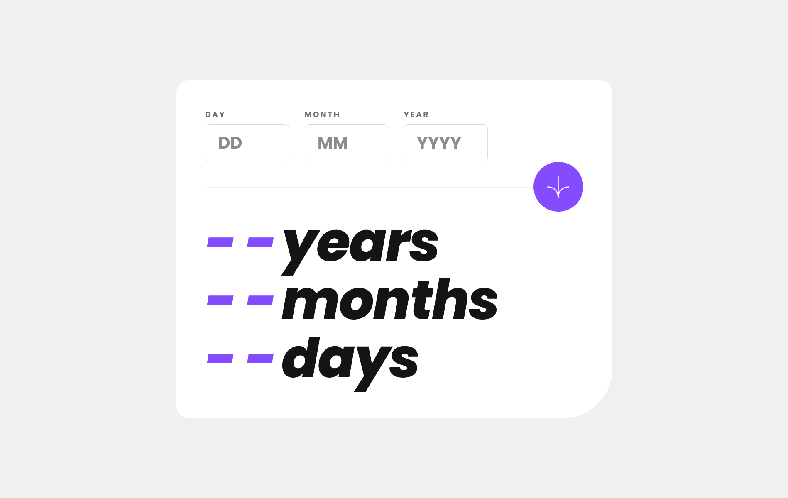
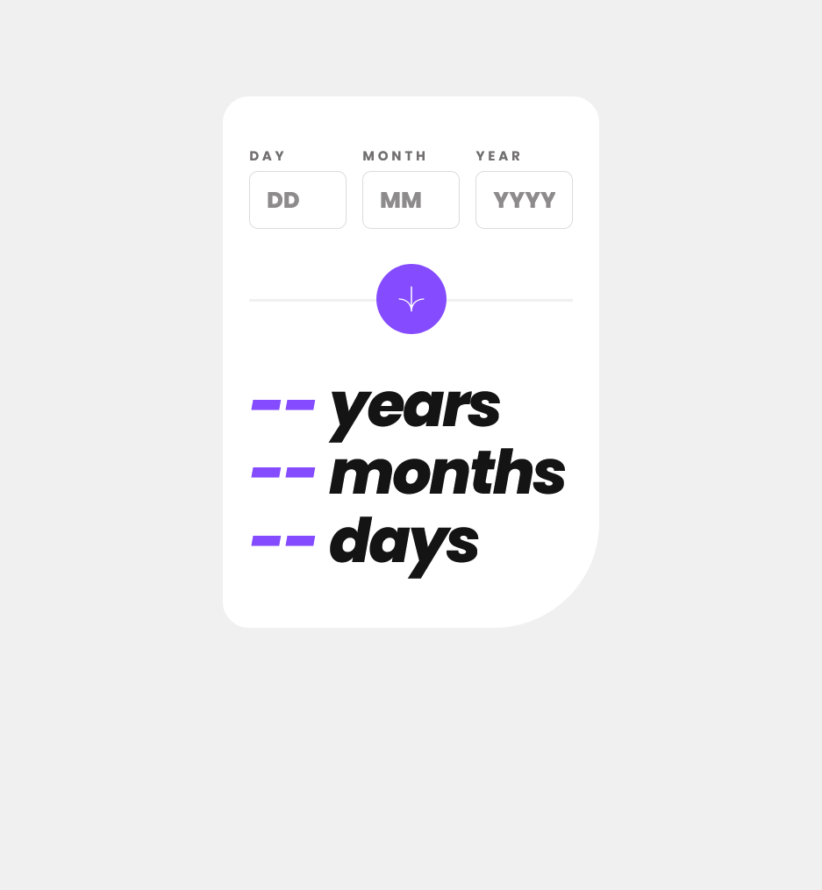

# Frontend Mentor - Age calculator app solution

This is a solution to the [Age calculator app challenge on Frontend Mentor](https://www.frontendmentor.io/challenges/age-calculator-app-dF9DFFpj-Q). Frontend Mentor challenges help you improve your coding skills by building realistic projects. 

## Table of contents

- [Overview](#overview)
  - [The challenge](#the-challenge)
  - [Screenshot](#screenshot)
  - [Links](#links)
- [My process](#my-process)
  - [Built with](#built-with)
  - [What I learned](#what-i-learned)
  - [Continued development](#continued-development)
  - [Useful resources](#useful-resources)
- [Author](#author)
- [Acknowledgments](#acknowledgments)

## Overview

### The challenge

Users should be able to:

- View an age in years, months, and days after submitting a valid date through the form
- Receive validation errors if:
  - Any field is empty when the form is submitted
  - The day number is not between 1-31
  - The month number is not between 1-12
  - The year is in the future
  - The date is invalid e.g. 31/04/1991 (there are 30 days in April)
- View the optimal layout for the interface depending on their device's screen size
- See hover and focus states for all interactive elements on the page
- **Bonus**: See the age numbers animate to their final number when the form is submitted

### Screenshot





### Links

- Solution URL: [https://www.frontendmentor.io/solutions/age-calculator-app-by-vanilla-js-PRxm2AOgoP](https://www.frontendmentor.io/solutions/age-calculator-app-by-vanilla-js-PRxm2AOgoP)
- Live Site URL: [https://age-calculator-app-egdn.onrender.com/](https://age-calculator-app-egdn.onrender.com/)

## My process

### Built with

- HTML5 markup
- CSS custom properties
- Flexbox
- CSS Grid
- Mobile-first workflow

### What I learned

Use `setFullYear()` to handle years from 0 to 99.

```js
newDate(year, monthIndex, day) {
  const date = new Date(0);
  date.setFullYear(year);
  date.setMonth(monthIndex);
  date.setDate(day);
  return date;
}
```

Date objects can be compared.

```js
isFuture(maxDate) {
  return new Date() < maxDate;
}
```

Use `Object.property.toString.call()` to check if it is a date object.

```js
isDate(date) {
  return Object.prototype.toString.call(date) === "[object Date]";
}
```

`new Date()` is based on 1970-01-01 00:00:00.

```js
calcAge(today, birthday) {
  if (!this.isDate(today) || !this.isDate(birthday)) {
    return false;
  }
  const till = new Date(today - birthday);
  const y = till.getFullYear() - 1970;
  const m = till.getMonth();
  const d = till.getDate() - 1;
  return {year: y, month: m, day: d};
}
```

`window.requestAnimationFrame()` can be easily handled by making it a Promise.

```js
waitAnimation() {
  return new Promise((resolve) => {
    window.requestAnimationFrame(resolve);
  });
}
```

```js
for (let i = 0; i <= 10; i++) {
  await this.waitAnimation();
  :
}
```

### Continued development

- I want to be able to use proper HTML elements.
- I want to be able to faithfully reproduce the design.
- I want to be able to handle asynchronous processing well.

### Useful resources

- [requestAnimationFrameのループはPromiseに変換すると簡潔に書ける（かも） - Qiita](https://qiita.com/access3151fq/items/6ef2b024b365685834ce) - Convert requestAnimationFrame to Promise.

## Author

- Frontend Mentor - [@junosakura](https://www.frontendmentor.io/profile/junosakura)

## Acknowledgments

Thank you to our Frontend Mentor, solution providers, and supportors.
