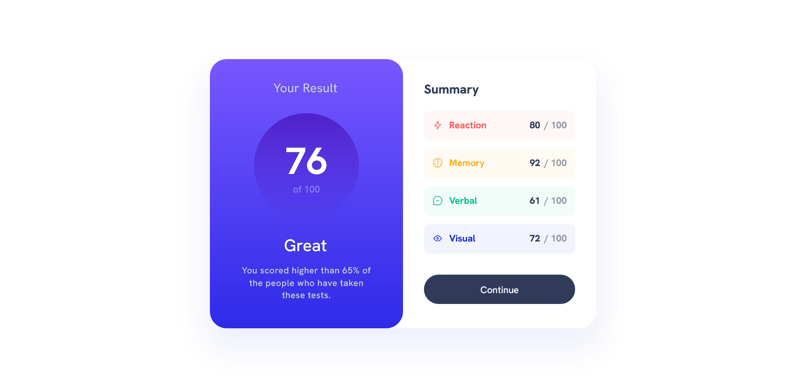
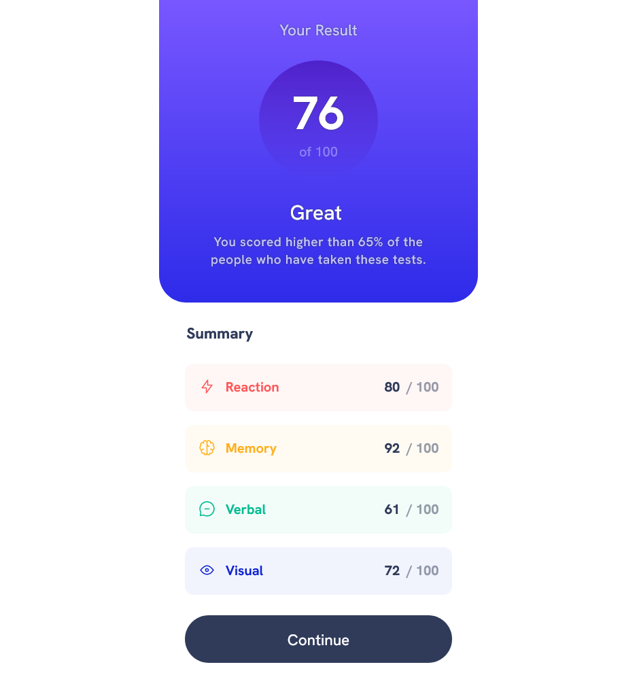

# Frontend Mentor - Results summary component solution

This is a solution to the [Results summary component challenge on Frontend Mentor](https://www.frontendmentor.io/challenges/results-summary-component-CE_K6s0maV). Frontend Mentor challenges help you improve your coding skills by building realistic projects. 

## Table of contents

- [Overview](#overview)
  - [The challenge](#the-challenge)
  - [Screenshot](#screenshot)
  - [Links](#links)
- [My process](#my-process)
  - [Built with](#built-with)
  - [What I learned](#what-i-learned)
  - [Continued development](#continued-development)
  - [Useful resources](#useful-resources)
- [Author](#author)
- [Acknowledgments](#acknowledgments)

## Overview

### The challenge

Users should be able to:

- View the optimal layout for the interface depending on their device's screen size
- See hover and focus states for all interactive elements on the page
- **Bonus**: Use the local JSON data to dynamically populate the content

### Screenshot





### Links

<!--TODO-->

- Solution URL: [Add solution URL here](https://your-solution-url.com)
- Live Site URL: [Add live site URL here](https://your-live-site-url.com)

## My process

### Built with

- Semantic HTML5 markup
- Flexbox
- Mobile-first workflow

### What I learned

```js
fetch("data.json")
.then((response) => response.json())
.then((data) => showScore(data));
```

### Continued development

<!--TODO-->

Use this section to outline areas that you want to continue focusing on in future projects. These could be concepts you're still not completely comfortable with or techniques you found useful that you want to refine and perfect.

**Note: Delete this note and the content within this section and replace with your own plans for continued development.**

- I want to be able to use proper HTML elements.
- I want to be able to faithfully reproduce the design.
- I want to be able to handle asynchronous processing well.

### Useful resources

- [fetch() - Web API | MDN](https://developer.mozilla.org/ja/docs/Web/API/fetch) - I learned how to load files in JavaScript.

## Author

- Frontend Mentor - [@junosakura](https://www.frontendmentor.io/profile/junosakura)


## Acknowledgments

Thank you to our Frontend Mentor, solution providers, and supportors.
